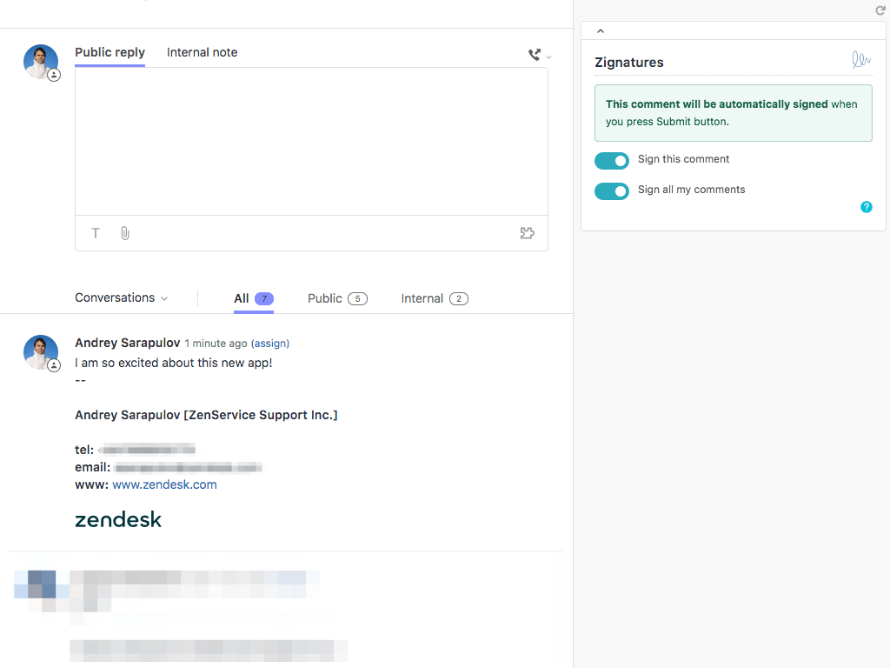
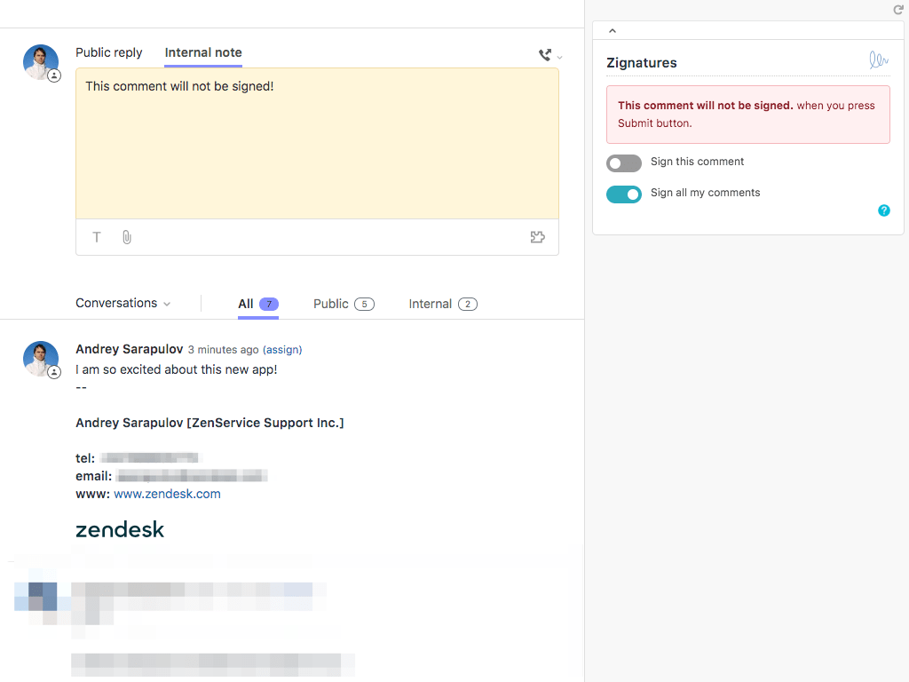
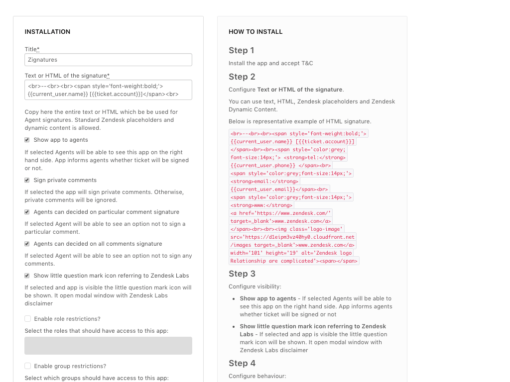

# Zignatures

Zignatures App enhances Agents, Admins and Marketing users to control, localise and customise signatures

Available in English, German and Russian languages.

### Description

Zignatures is ticket sidebar/new ticket sidebar app which solves very old product limitation around Agent signatures.
Out of the box Zendesk signatures are very limited in terms of localisation, customisation and advanced logic.
Zignatures solves all these limitations allowing Admins to create intelligent signatures with any type of look and feel,
enabling Agents to see and control signatures behaviour and ultimately make it possible for Marketing people to use this space more effectively.
Zignatures app solves real problem reported by customers like Dorchester or Radio Holland.
Zignatures app is completed and ready to be shipped, it is translated in several languages and uses latest Zendesk technologies like ZAF v2 and Zendesk gardens.

### App settings

* signature_template - Copy here the entire text or HTML which be be used for Agent signatures. Standard Zendesk placeholders and dynamic content is allowed.
* show_app_to_agents - If selected Agents will be able to see this app on the right hand side. App informs agents whether ticket will be signed or not.
* sign_private_comment - If selected the app will sign private comments. Otherwise, private comments will be ignored.
* agents_can_decide_on_comment_signatures - If selected Agent will be able to see an option not to sign a particular comment
* agents_can_decide_on_ticket_signatures - If selected Agent will be able to see an option not to sign all comments particular comment
* show_labs_icon - If selected and App is visible the little question mark icon will be shown. It open modal window with Zendesk Labs disclaimer

### Signature template samples

#### default

```
<br>--<br><br><span style='font-weight:bold;'>{{current_user.name}} [{{ticket.account}}]</span><br><br><span style='color:grey;font-size:14px;'><strong>tel:</strong> {{current_user.phone}}</span><br><span style='color:grey;font-size:14px;'><strong>email:</strong> {{current_user.email}}</span><br><span style='color:grey;font-size:14px;'><strong>www:</strong> <a href='https://www.zendesk.com/' target=_blank'>www.zendesk.com</a></span><br><br><span></span>
```


#### marketing

```
<br>--<br><br><div style='font-family: "Helvetica Neue", Helvetica, Arial, sans-serif;'><span style='font-weight:bold;'>{{current_user.name}} [{{ticket.account}}]</span><br><br><span style='color:grey;font-size:14px;'><strong></strong> {{current_user.phone}}</span><br><span style='color:grey;font-size:14px;'><strong></strong> {{current_user.email}}</span><br><span style='color:grey;font-size:14px;'><strong></strong> <a href='https://www.zendesk.com/' target=_blank'>www.zendesk.com</a></span><br><br><span>Joing us celebrating 100 000 live customers!</span><br><br><span></span></div>
```


#### support

```
<br>--<br><br><div style='font-family: "Helvetica Neue", Helvetica, Arial, sans-serif;'>Regards,<br><br><span  style='font-weight:bold;'>{{current_user.name}} [{{ticket.account}}]</span><br><br><span style='color:grey;font-size:14px;'><strong>tel:</strong> {{current_user.phone}}</span><br><span style='color:grey;font-size:14px;'><strong>email:</strong> {{current_user.email}}</span><br><span style='color:grey;font-size:14px;'><strong>www:</strong> <a href='https://www.zendesk.com/' target=_blank'>www.zendesk.com</a></span><br><br><span>We also have amazing knowledge base. Checking this out.<br><a href='https://support.zendesk.com/hc/' target=_blank'>https://support.zendesk.com/hc/</a></span></div>
```


### App in action


### Screenshots






